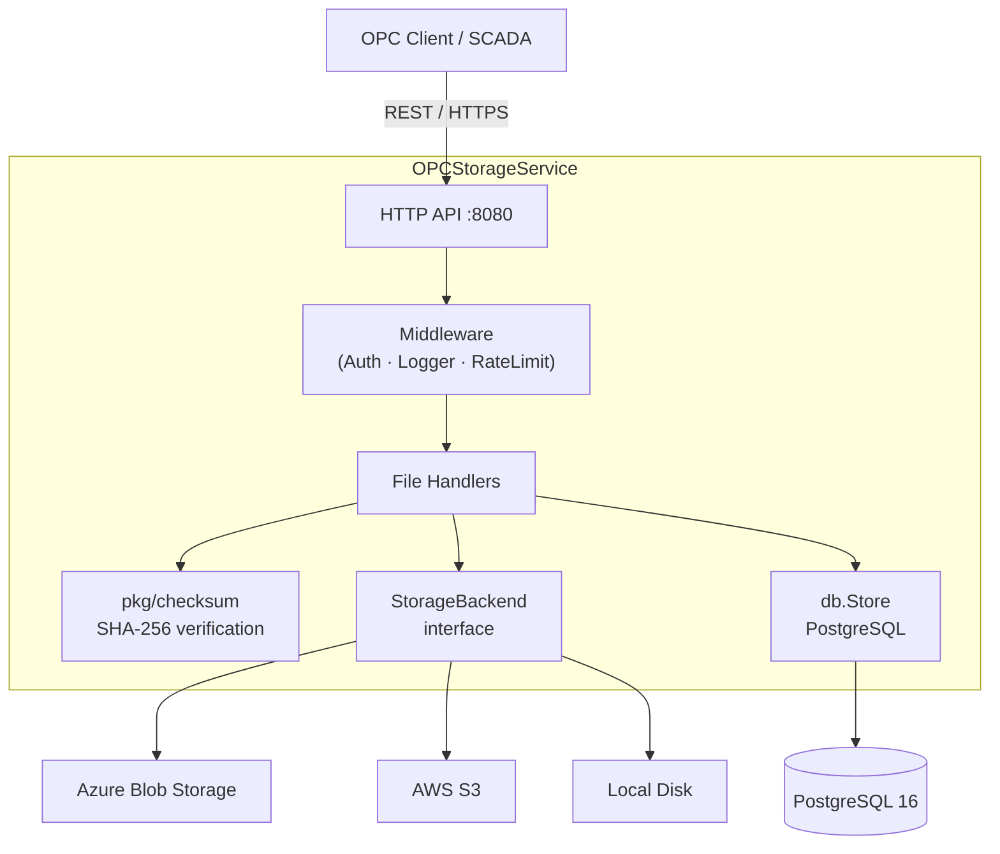

# OPC Storage Service


A cloud-native backend for managing **OPC-UA / OPC-DA industrial files** with
chunked uploads, SHA-256 integrity verification, rich metadata, and pluggable
multi-cloud storage (Azure Blob, AWS S3, local disk).

---

## Architecture



---

## Tech Stack

| Layer | Technology |
|-------|------------|
| Language | Go 1.22 |
| HTTP framework | `net/http` (stdlib) |
| Config | Viper *(planned)* |
| Database | PostgreSQL 16 + sqlc *(planned)* |
| Primary storage | Azure Blob Storage |
| Observability | Prometheus + Grafana *(planned)* |
| Container | Docker (distroless runtime) |
| CI/CD | GitHub Actions |

---

## Project Structure

```
opcfs/
├── cmd/server/          # Binary entrypoint
├── internal/
│   ├── api/             # HTTP handlers & router
│   ├── config/          # Config loading (Viper)
│   ├── db/              # Database queries (sqlc/ent)
│   ├── middleware/       # Auth, logging, rate limiting
│   └── storage/         # StorageBackend interface + backends
├── pkg/
│   └── checksum/        # Reusable SHA-256 helpers
├── deploy/
│   ├── docker/          # Dockerfile (multi-stage)
│   └── grafana/         # Dashboard JSON exports
└── .github/workflows/   # CI/CD pipelines
```

---

## Local Setup

### Prerequisites

- Go 1.22+
- Docker & Docker Compose
- `golangci-lint` (`brew install golangci-lint` or see [docs](https://golangci-lint.run/usage/install/))

### Run locally

```bash
# 1. Clone
git clone https://github.com/be1ani/opcfs.git
cd opcfs

# 2. Tidy dependencies
make tidy

# 3. Build
make build

# 4. Run (defaults to :8080)
LISTEN_ADDR=:8080 make run

# 5. Verify
curl http://localhost:8080/healthz
```

### Build Docker image

```bash
make docker-build
docker run -p 8080:8080 opcfs:latest
```

### Run tests & lint

```bash
make test
make lint
```

---

## Environment Variables

| Variable | Default | Description |
|----------|---------|-------------|
| `LISTEN_ADDR` | `:8080` | TCP address the HTTP server binds to |

*(More variables will be documented here as config is wired up.)*

---

## Contributing

1. Fork → feature branch → PR against `main`
2. All PRs must pass `make test` and `make lint`
3. Follow [Conventional Commits](https://www.conventionalcommits.org/)

---

## License

MIT © 2026 be1ani
